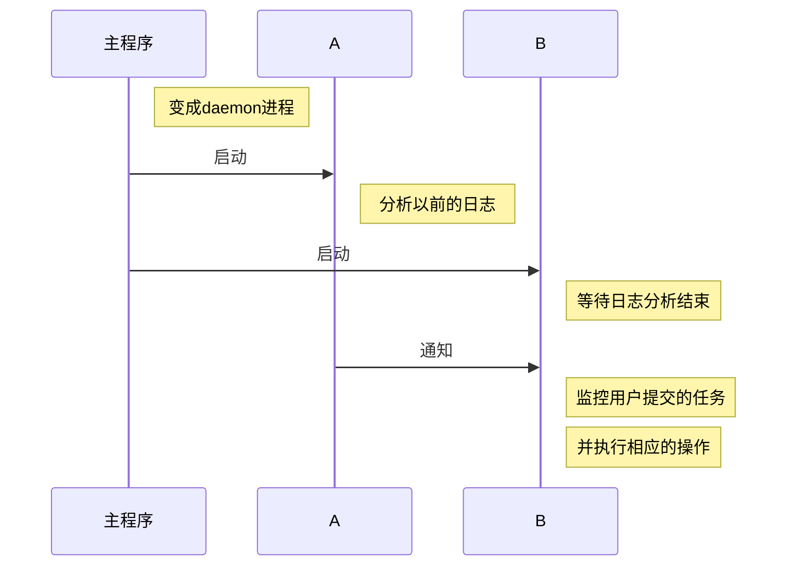

# 代码


*不定期的更新代码，修复bug*  
[github地址](https://github.com/1013553207/seplunk)

# 数据库设计

### 数据库用sqlite3
1.sqlite轻量级
2.绿色组件
3.单一文件
4.跨平台
5.查询效率极高
6.使用事务插入速度极快
7.支持limit分页
8.适合查询速度要求较高，内存占用较少的场合

### 用户表结构
1.user用户表结构
```sql
CREATE TABLE 'user'(
                'uid' INTEGER PRIMARY KEY AUTOINCREMENT,
                'username' VARCHAR(255) NOT NULL UNIQUE,
                'forbid' TINYINT(8) NOT NULL DEFAULT 0,
                'health_point' INTEGER NOT NULL DEFAULT 2);

```
uid主键自增，标示用户的id，username是用户的名字，forbid标示是否是禁止用户，health_point标示执行多少次违规操作后被拉进黑名单

2.job执行信息总结表
```sql
CREATE TABLE 'job_summary' ('finishTime' varchar(255),
                            'firstReduceTaskLaunchTime' varchar(255),
                            'numMaps' varchar(255),
                            'reduceSlotSeconds' varchar(255),
                            'job_id' varchar(255),
                            'resourcesPerMap' varchar(255),
                            'job_checksum' varchar(255),
                            'firstMapTaskLaunchTime' varchar(255),
                            'status' varchar(255),
                            'jobName' varchar(255),
                            'queue' varchar(255),
                            'submitTime' varchar(255),
                            'mapSlotSeconds' varchar(255),
                            'launchTime' varchar(255),
                            'user' varchar(255),
                            'numReduces' varchar(255),
                            'resourcesPerReduce' varchar(255),
                            'failedMaps' varchar(255),
                            'failedReduces' varchar(255),
                            CONSTRAINT 'job_summaryId_pri' PRIMARY KEY('user', 'job_id'),
                            CONSTRAINT 'job_summaryId_ref' FOREIGN KEY ('user') REFERENCES user('username'));
```
以上信息保存了整个任务执行过程的统计信息，包括map的个数，reduce个数等等

3.job配置信息的表
```sql
CREATE TABLE 'job_conf' (
'yarn.nodemanager.linux-container-executor.resources-handler.class' varchar(255),
'dfs.namenode.decommission.nodes.per.interval' varchar(255),
'yarn.client.nodemanager-connect.max-wait-ms' varchar(255),
'dfs.namenode.name.dir' varchar(255),
'hadoop.security.random.device.file.path' varchar(255),
'hadoop.registry.secure' varchar(255)
...
...
...
)
```
这个表格保存了hadoop所有配置选项，由于太多不就一一列举出来了

### 数据库存储信息展示
![enter description here][1]


# 程序的序列图

### 序列图

### 代码示例
```python

def seplunk_start(config_path):
    '''主流程'''
    p_log_conn, p_monitor_conn = Pipe()
    # 启动进程A,分析以前的日志
    p_log = Process(target=create_process_log,
            args=(hdfs_client, config, conn, p_log_conn))
    p_log.start()
    # 启动进程B,监控用户的提交
    p_monitor = Process(target=create_process_monitor,
        args=(hdfs_client, config, conn, p_monitor_conn))
    p_monitor.start()

def create_process_log(hdfs_client, config, conn, pipe):
    LOGGER.info("start  log process")
    from seplunk import DEBUG
    first = True
    while False if DEBUG else True:
        parse_log(hdfs_client, config, conn)
        if first:
            pipe.send(["start monitor"])
            first = False
        time.sleep(30)

def create_process_monitor(hdfs_client, config, conn, pipe):
    LOGGER.info("start monitor process")
    from seplunk import DEBUG
    first = True
    while False if DEBUG else True:
        if first:
            pipe.recv()
            first = False
        monitor_am(hdfs_client, config, conn)
        time.sleep(8)

```
### 守护进程执行过程
->(‪![enter description here][2])<-


### 程序的大致处理流程

__注：部分可能不太一致, 代码更重要的是对正在运行任务的代码，configure设置的参数，map分配数，失败数,reduce分配数，失败数等等信息进行分析和处理，和以前该用户提交的作业情况进行对比, 并没有考虑计算节点的事情__

![enter description here][3]

# 实验hadoop配置
### 实验hadoop需要配置一下信息
```python
{'core-site.xml' : ["fs.defaultFS"],
'mapred-site.xml' :
        [
        "yarn.app.mapreduce.am.staging-dir",
        "mapreduce.jobhistory.done-dir",
        "mapreduce.jobhistory.intermediate-done-dir",
        ],
'yarn-site.xml' :
        [
        "yarn.nodemanager.remote-app-log-dir",
        "yarn.log-aggregation-enable"
        ]
}
```
上面说明每个文件下应该有的属性和值，比如说core-site.xml里应该设置有fs.defaultFS的属性和值，下面是列举两个配置项的官方说明
yarn.app.mapreduce.am.staging-dir: *'''The staging dir used while submitting jobs.'''*

yarn.log-aggregation-enable: *'''Whether to enable log aggregation. Log aggregation collects each container's logs and moves these logs onto a file-system, for e.g. HDFS, after the application completes. Users can configure the "yarn.nodemanager.remote-app-log-dir" and "yarn.nodemanager.remote-app-log-dir-suffix" properties to determine where these logs are moved to. Users can access the logs via the Application Timeline Server.'''*

### 实验hadoop的架构

            --- slave1
    master |
            ----slave2

### 实验hadoopd的hdfs目录结构
![enter description here][4]


# 实验展示

### 实验结果 

1.__前提__：
    用户执行一个失败很多次的任务，同样的job参数，同样的map,reduce个数，代码相似度100%  而且用户黑名单里，直接杀死任务
2.__提交作业__
    ![enter description here][5]
3.__作业被kill__
    ![enter description here][6]
4. __数据库保存该用户已提交作业的全部信息__
![enter description here][7]


  [1]: ./images/jobsummary_database.png "jobsummary_database.png"
  [2]: ./images/bg.png "bg.png"
  [3]: ./images/%E6%9E%B6%E6%9E%84%E5%9B%BE.png "架构图.png"
  [4]: ./images/hdfs.png "hdfs.png"
  [5]: ./images/%E6%8F%90%E4%BA%A4%E4%BD%9C%E4%B8%9A.png "提交作业.png"
  [6]: ./images/%E7%BB%88%E6%AD%A2%E4%BD%9C%E4%B8%9A.png "终止作业.png"
  [7]: ./images/result.png "result.png"