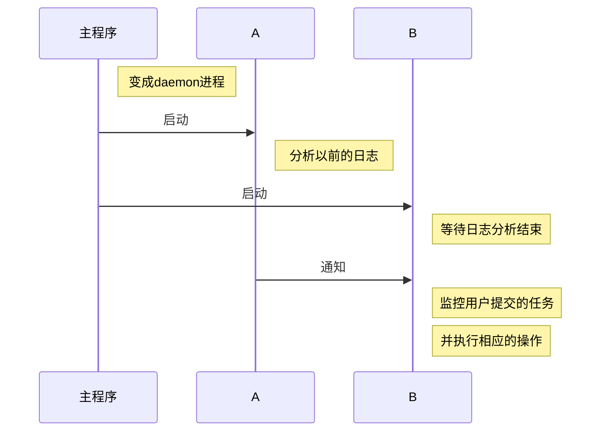

# 一，背景
随着移动互联网，物联网的普及，各种智能设备，服务器产生越来越多的数据，急需一个扩展性强的工具进行存储和处理，在开源界hadoop已经是业界标准，对其研究和分析是极其有必要的，和操作系统类似，其作业管理和用户管理是比较重要的概念，特别是YARN的研究和分析都是比较有价值的事情， 分析其不完善的地方，进行改进。基本上hadoop集群大部分都是公司内部使用，但是特别是现在云计算的兴起，在各种云平台上，也有供各种各样人使用的集群，对hadoop潜在的安全问题分析，可以让这些云平台的集群可以更好地给大家提供服务。

# 二，已经存在的安全机制

## 1.用户认证
Hadoop提供了两种安全机制：Simple和Kerberos。Simple机制（默认情况，Hadoop采用该机制）采用了SAAS协议。 也就是说，用户提交作业时，你说你是XXX（在JobConf的user.name中说明），则在JobTracker端要进行核实，包括两部分核实，一是你到底是不是这个人，即通过检查执行当前代码的人与user.name中的用户是否一致；然后检查ACL（Access Control List）配置文件（由管理员配置），看你是否有提交作业的权限。一旦你通过验证，会获取HDFS或者mapreduce授予的delegation token（访问不同模块由不同的delegation token），之后的任何操作，比如访问文件，均要检查该token是否存在，且使用者跟之前注册使用该token的人是否一致

## 2. RPC安全机制
   RPC安全机制在Hadoop RP中添加了权限认证授权机制。当用户调用RPC时，用户的login name会通过RPC头部传递给RPC，之后RPC使用Simple Authentication and Security Layer（SASL）确定一个权限协议（支持Kerberos和DIGEST-MD5两种），完成RPC授权。
## 3.HDFS安全机制
HDFS安全机制Client获取namenode初始访问认证（使用kerberos）后，会获取一个delegation token，这个token可以作为接下来访问HDFS或者提交作业的凭证。
同样，为了读取某个文件，client首先要与namenode交互，获取对应block的的block access token，然后到相应的datanode上读取各个block，而datanode在初始启动向namenode注册时，已经提前获取了这些token，当client要从TaskTracker上读取block时，首先验证token，通过后才允许读取


## 4.MapReduce安全机制
**【Job Submission】**
所有关于作业的提交或者作业运行状态的追踪均是采用带有Kerberos认证的RPC实现的。授权用户提交作业时，JobTracker会为之生成一个delegation token，该token将被作为job的一部分存储到HDFS上并通过RPC分发给各个TaskTracker，一旦job运行结束，该token失效。
**【Task】**
用户提交作业的每个task均是以用户身份启动的，这样，一个用户的task便不可以向TaskTracker或者其他用户的task发送操作系统信号，最其他用户造成干扰。这要求为每个用户在所有TaskTracker上建一个账号。
**【shuffle】**
当一个map task运行结束时，它要将计算结果告诉管理它的TaskTracker，之后每个reduce task会通过HTTP向该TaskTracker请求自己要处理的那块数据，Hadoop应该确保其他用户不可以获取map task的中间结果，其做法是：reduce task对“请求URL”和“当前时间”计算HMAC-SHA1值，并将该值作为请求的一部分发动给TaskTracker，TaskTracker收到后会验证该值的正确性。


# 三，存在的潜在问题

## 1.在共享平台存在的问题
由于是共享平台，可以都是在一个集群上运行作业，所以有些恶意的用户可以随意的，无节制的提交任务，这就造成其他用户无法使用，所以要丢用户提交的任务进行分析，防止用户一直提交一样参数，一样代码，而且最终执行结果失败的任务
## 2.认证机制的问题
内部有一个简单的认证机制，导致Linux上的nobody都可以冒充superuser用户，并没有严格的进行认证
## 3.访问控制问题
基于Linux用户组信息的文件访问控制机制，本地权限可以被恶意的用户利用
## 4.不设防的文件存储
由于hdfs存储文件块，仅仅是对文件块进行多地备份，并没有进行加密混淆等，这样恶意用户可以随意的进行获取各种信息


#　四, 新增的安全机制

第一个问题是比较重要的，因为在公共平台的hadoop， 用户只有通过master节点进行提交任务的权利，和通过namenode节点使用hdfs的权利，后两个问题只有管理员才能看到，比如阿里云，我们还是选择相信这些大公司的，毕竟一旦管理员泄露信息，对公司品牌是致命的打击，所以对于这些公共平台的搭建者， 第一个问题才是最急需解决的问题，于是我们提出了一下两个方案，
**第一方案就是沙箱技术，对集群进行分割出一部分资源进行预执行，作为隔离检测策略，其中5%的节点作为检测节点，剩余的作为正常的执行节点。
第二个就是黑名单技术，检测用户提交的任务，分析任务的代码和参数，包括输入参数，这里有一个小问题就是输入参数代表多大的计算资源，并没有办法做检测，　记录下来这个任务的各种信息，和以前提交的任务进行对比，如果发现一个同样的任务，同样的设置参数，同样的输入都是一致的话，　而且超过多少次的失败记录，可以认为这个任务极大可能是恶意，可以对作业进行杀死操作，并且把用户拉黑。
**

#　五, 新增的安全机制的实现

## １,数据库用sqlite3
1.sqlite轻量级
2.绿色组件
3.单一文件
4.跨平台
5.查询效率极高
6.使用事务插入速度极快
7.支持limit分页
8.适合查询速度要求较高，内存占用较少的场合

## ２，用户表结构
（1）.user用户表结构
```sql
CREATE TABLE 'user'(
                'uid' INTEGER PRIMARY KEY AUTOINCREMENT,
                'username' VARCHAR(255) NOT NULL UNIQUE,
                'forbid' TINYINT(8) NOT NULL DEFAULT 0,
                'health_point' INTEGER NOT NULL DEFAULT 2);

```
uid主键自增，标示用户的id，username是用户的名字，forbid标示是否是禁止用户，health_point标示执行多少次违规操作后被拉进黑名单

（2）.job执行信息总结表
```sql
CREATE TABLE 'job_summary' ('finishTime' varchar(255),
                            'firstReduceTaskLaunchTime' varchar(255),
                            'numMaps' varchar(255),
                            'reduceSlotSeconds' varchar(255),
                            'job_id' varchar(255),
                            'resourcesPerMap' varchar(255),
                            'job_checksum' varchar(255),
                            'firstMapTaskLaunchTime' varchar(255),
                            'status' varchar(255),
                            'jobName' varchar(255),
                            'queue' varchar(255),
                            'submitTime' varchar(255),
                            'mapSlotSeconds' varchar(255),
                            'launchTime' varchar(255),
                            'user' varchar(255),
                            'numReduces' varchar(255),
                            'resourcesPerReduce' varchar(255),
                            'failedMaps' varchar(255),
                            'failedReduces' varchar(255),
                            CONSTRAINT 'job_summaryId_pri' PRIMARY KEY('user', 'job_id'),
                            CONSTRAINT 'job_summaryId_ref' FOREIGN KEY ('user') REFERENCES user('username'));
```
以上信息保存了整个任务执行过程的统计信息，包括map的个数，reduce个数等等

（3）.job配置信息的表
```sql
CREATE TABLE 'job_conf' (
'yarn.nodemanager.linux-container-executor.resources-handler.class' varchar(255),
'dfs.namenode.decommission.nodes.per.interval' varchar(255),
'yarn.client.nodemanager-connect.max-wait-ms' varchar(255),
'dfs.namenode.name.dir' varchar(255),
'hadoop.security.random.device.file.path' varchar(255),
'hadoop.registry.secure' varchar(255)
...
...
...
)
```
这个表格保存了hadoop所有配置选项，由于太多不就一一列举出来了

数据库存储信息展示
![enter description here][1]


## 3. 程序结构

### （1）序列图

### （2）代码示例
```python

def seplunk_start(config_path):
    '''主流程'''
    p_log_conn, p_monitor_conn = Pipe()
    # 启动进程A,分析以前的日志
    p_log = Process(target=create_process_log,
            args=(hdfs_client, config, conn, p_log_conn))
    p_log.start()
    # 启动进程B,监控用户的提交
    p_monitor = Process(target=create_process_monitor,
        args=(hdfs_client, config, conn, p_monitor_conn))
    p_monitor.start()

def create_process_log(hdfs_client, config, conn, pipe):
    LOGGER.info("start  log process")
    from seplunk import DEBUG
    first = True
    while False if DEBUG else True:
        parse_log(hdfs_client, config, conn)
        if first:
            pipe.send(["start monitor"])
            first = False
        time.sleep(30)

def create_process_monitor(hdfs_client, config, conn, pipe):
    LOGGER.info("start monitor process")
    from seplunk import DEBUG
    first = True
    while False if DEBUG else True:
        if first:
            pipe.recv()
            first = False
        monitor_am(hdfs_client, config, conn)
        time.sleep(8)

```
### （3）守护进程执行过程
![enter description here][2]


### （4）程序的大致处理流程

__注：部分可能不太一致, 代码更重要的是对正在运行任务的代码，configure设置的参数，map分配数，失败数,reduce分配数，失败数等等信息进行分析和处理，和以前该用户提交的作业情况进行对比, 并没有考虑计算节点的事情__

![enter description here][3]

## 4. 实验hadoop配置
### （1）实验hadoop需要配置一下信息
```python
{'core-site.xml' : ["fs.defaultFS"],
'mapred-site.xml' :
        [
        "yarn.app.mapreduce.am.staging-dir",
        "mapreduce.jobhistory.done-dir",
        "mapreduce.jobhistory.intermediate-done-dir",
        ],
'yarn-site.xml' :
        [
        "yarn.nodemanager.remote-app-log-dir",
        "yarn.log-aggregation-enable"
        ]
}
```
上面说明每个文件下应该有的属性和值，比如说core-site.xml里应该设置有fs.defaultFS的属性和值，下面是列举两个配置项的官方说明
yarn.app.mapreduce.am.staging-dir: *'''The staging dir used while submitting jobs.'''*

yarn.log-aggregation-enable: *'''Whether to enable log aggregation. Log aggregation collects each container's logs and moves these logs onto a file-system, for e.g. HDFS, after the application completes. Users can configure the "yarn.nodemanager.remote-app-log-dir" and "yarn.nodemanager.remote-app-log-dir-suffix" properties to determine where these logs are moved to. Users can access the logs via the Application Timeline Server.'''*

### （2）实验hadoop的架构

            --- slave1
    master |
            ----slave2

### （3）实验hadoopd的hdfs目录结构
![enter description here][4]


## 5.实验展示

### 实验结果

__前提__：
    用户执行一个失败很多次的任务，同样的job参数，同样的map,reduce个数，代码相似度100%  而且用户黑名单里，直接杀死任务
__提交作业__
![enter description here][5]
__作业被kill__
![enter description here][6]
__数据库保存该用户已提交作业的全部信息__
![enter description here][7]


  [1]: ./images/job_summary.png "jobsummary_database.png"
  [2]: ./images/daemon.png "bg.png"
  [3]: ./images/%E6%9E%B6%E6%9E%84%E5%9B%BE.png "架构图.png"
  [4]: ./images/hdfs.png "hdfs.png"
  [5]: ./images/%E6%8F%90%E4%BA%A4%E4%BD%9C%E4%B8%9A.png "提交作业.png"
  [6]: ./images/%E7%BB%88%E6%AD%A2%E4%BD%9C%E4%B8%9A.png "终止作业.png"
  [7]: ./images/result.png "result.png"